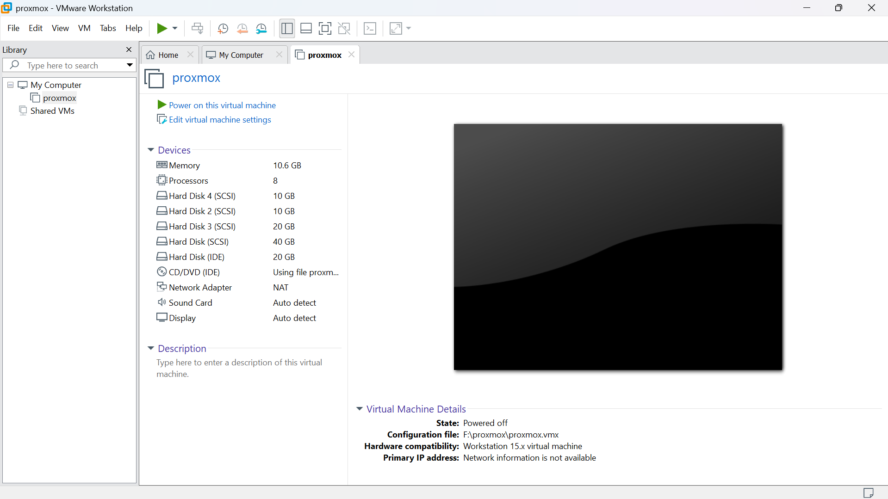
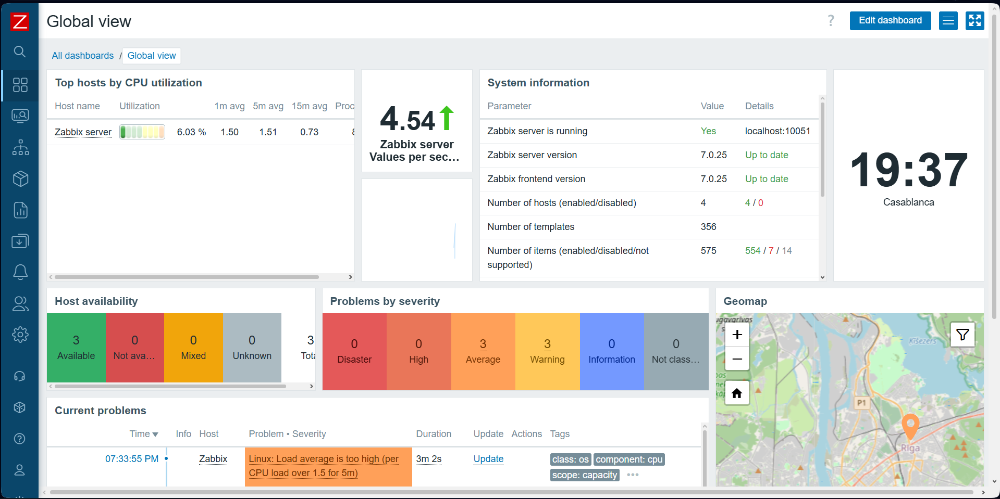

# 🚀 Enterprise Infrastructure Monitoring & Virtualization

## 📋 Project Overview
Deployment of a complete, secure, and monitored IT infrastructure. This project showcases the migration from a planned ESXi environment to a functional **Proxmox VE 8.3.0** ecosystem with advanced monitoring and storage solutions.

## 🏗️ Topology & Infrastructure
The environment is virtualized on **Proxmox** and consists of the following nodes:
- **Firewall (pfSense):** Network security, VLAN segmentation (WAN, LAN, WiFi Office/Clients).
- **Directory Services:** Windows Server (Active Directory Domain Services).
- **Storage:** XigmaNAS for centralized network-attached storage.
- **Monitoring (Zabbix):** Centralized monitoring for performance and availability.

## 📊 Monitoring Strategy (Zabbix 7.0)
The infrastructure is monitored in real-time, providing high visibility into system health:
- **Zabbix Agent:** Successfully deployed on the Proxmox host (`pve`) with full metrics for CPU, RAM, and Storage.
- **Performance:** Processing an average of **5.77 values per second**.
- **Visibility:** Tracking 357+ items including all virtual network interfaces (`vmbr0`, `tap100i0`, etc.).

## 🔧 Technical Challenges Overcome
- **Repository Fix:** Resolved APT repository `401 Unauthorized` errors on Proxmox by configuring non-subscription sources.
- **SNMP Integration:** Configured SNMP v2 on pfSense to bridge security monitoring with Zabbix.
- **Service Stability:** Ensured Zabbix Agent is active and persistent with PID management.

## 📸 Screenshots
### Infrastructure View (Proxmox)

### Monitoring Dashboard (Zabbix)

